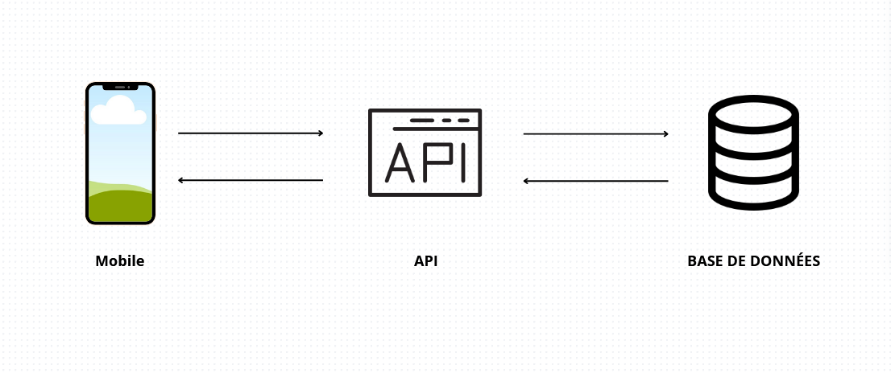

# Dossier

## 1. Choix architecturaux

### Backend – **Modèle MVC**

Pour la partie backend, nous avons opté pour une architecture **MVC (Model - View - Controller)**. Cette structure permet une **séparation claire des responsabilités** :
- Le **Model** gère les données et la logique métier.
- Le **Controller** reçoit les requêtes, applique la logique, puis renvoie une réponse.
- La **View** (dans le cadre d’une API, il s’agit de la réponse JSON) représente la couche visible des données.

Ce choix est pertinent dans notre projet car il facilite la **lisibilité du code**, le **débogage** et le **travail en équipe**, chaque membre pouvant se concentrer sur une couche spécifique.

### Frontend – **Atomic Design**

Côté frontend, nous avons utilisé la méthodologie **Atomic Design**. Cette approche consiste à créer une interface utilisateur à partir de composants réutilisables classés par granularité :
- **Atoms** : éléments de base (boutons, champs de saisie…)
- **Molecules** : groupements simples (ex. : un champ + un label)
- **Organisms** : sections complètes (formulaires, headers…)
- **Templates / Pages** : structure globale d’une page

Cette structure est **parfaite pour React Native**, car elle permet de construire des composants cohérents, testables et maintenables. Elle favorise également la **réutilisation** et l’**évolutivité** de l’interface utilisateur.

---

## 2. Modèle de données
https://drawsql.app/teams/galacticos/diagrams/musicians-network/embed

---

## 3. Choix techniques

- **Frontend** : React Native avec Expo
- **Backend** : Java Spring Boot
- **Base de données** : MariaDB
- **Tests** : Aucun test n’a été implémenté

### Schéma d'interaction



> Ce schéma illustre les échanges entre les différentes couches de l'application :  
> - L'application mobile (React Native) envoie des requêtes HTTP au backend Spring Boot  
> - Le backend gère la logique métier, effectue les traitements, vérifie l’authentification via JWT, et interagit avec la base de données  
> - La base de données MariaDB stocke les informations des utilisateurs, des événements, messages.

---

## 4. Spécifications fonctionnelles développées

- **Authentification** : 
  - Inscription
  - Connexion
  - Authentification via JWT
  - Gestion des routes sécurisées

- **Utilisateurs** : 
  - Lister tous les utilisateurs
  - Filtres sur les utilisateurs
  - Création et modification d’un profil

- **Événements** : 
  - Affichage de tous les événements
  - Affichage sur une carte
  - Ajout d’un événement
  - Filtrage des événements

- **Messagerie** :
  - Création d’une discussion
  - Envoi d’un message
  - Suppression d’un message
  - Modification d’un message

---

## 6. Un test développé

Aucun test unitaire ou fonctionnel n’a été mis en place dans le projet.

---

## 7. Déploiement

Le déploiement du **backend** a été automatisé avec **Terraform** (provisionnement de l’infrastructure) et **Ansible** (configuration du serveur et déploiement de l’application).

### 🏗️ Provisionnement – Terraform

```bash
terraform init
terraform plan
terraform apply -auto-approve
```
---

### 🔧 Déploiement – Ansible

Ansible est **déclenché automatiquement par Terraform** en fin de provisionnement. Il est cependant possible de le relancer manuellement :

```bash
ANSIBLE_HOST_KEY_CHECKING=False ansible-playbook \
   -i ansible/inventory/prod-france-instance \
   -u {ssh_user} \
   --private-key keys/prod-france-instance-key.pem \
   ansible/playbook.yml
```

#### 🧰 Tâches réalisées automatiquement :

- Installation de **Nginx**, **Docker**, **Docker Compose**
- Activation et démarrage des services (`nginx`, `docker`)
- Ajout de l’utilisateur au groupe `docker`
- Génération d’une **clé SSH** pour l’authentification avec GitHub
- Ajout de la clé publique à GitHub via son **API REST**
- Clonage du **repository privé** contenant le backend
- Copie du fichier `.env` dans le bon répertoire
